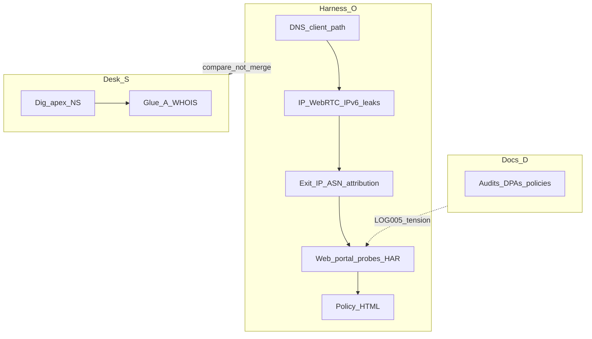
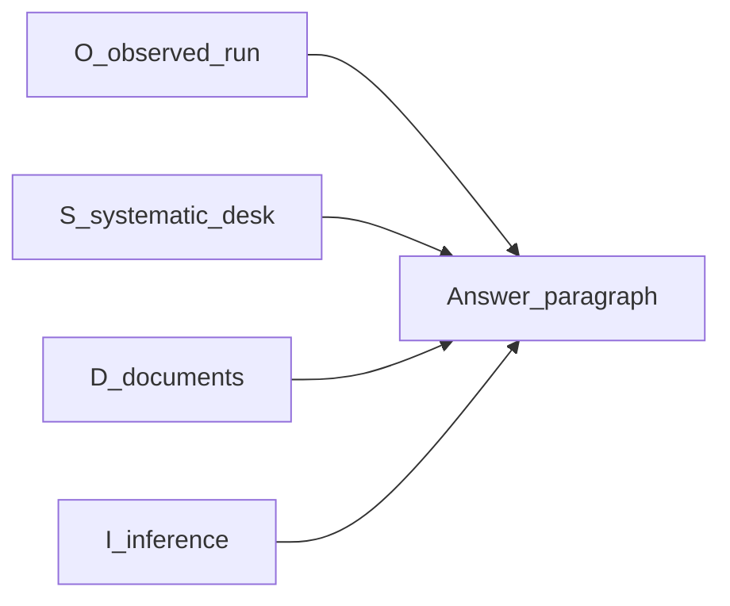

# Research questions, evidence map, and example answers

This document maps the SPEC question bank ([`configs/framework/questions.yaml`](../configs/framework/questions.yaml)) and supplemental team questions to **observable artifacts**, **systematic desk research**, and **document-only** sources. It defines how to combine **inside-the-tunnel** measurements with **outside** DNS/WHOIS and policy work without conflating them.

See also: [Methodology](methodology.md) (harness order of operations), [Data dictionary](data-dictionary.md) (paths), [Framework](framework.md) (synthesis in `normalized.json`).

---

## A. Methodology

### A.1 Inside-out vs desk vs documents

| Mode | Label | What it is |
|------|--------|------------|
| **Harness run** | **O** (observed) | Data produced while the VPN is the intended default path on the benchmark machine: `vpn-leaks run` → `runs/<run_id>/…`. |
| **Systematic desk** | **S** | Reproducible commands from a **normal** resolver path (or documented comparison): e.g. `dig apex NS`, resolve NS names, `whois` on glue IPs. **Dated transcript** required. |
| **Documents / audits** | **D** | Privacy policy, DPA, subprocessors, ISAE PDFs, vendor blog. Not provable from `ip-check.json` alone. |
| **Inference** | **I** | Best-effort interpretation (e.g. “CDN likely fronts API”). Must be labeled and verified when possible. |

Stack order in [A.2](#a2-stack-order-bottom-up) is primarily **O**; parallel **S** for apex delegation is in [Section H](#h-systematic-desk-playbook).

**Critical contrast:** In-tunnel `competitor_probe/provider_dns.json` may **timeout** or differ from a desk `dig` (VPN stub DNS, split horizon). **Do not** merge O and S without stating both paths. Example: desk `dig nordvpn.com NS` may show Cloudflare NS while `provider_dns` shows resolver errors during the same campaign—both are evidence, not duplicates.

### A.2 Stack order (bottom-up)

1. **Client DNS path** — What resolver addresses appear (`dnsleak/`, `normalized.dns_servers_observed`).
2. **Leak surface** — IPv4/IPv6/WebRTC vs exit (`ip-check.json`, `webrtc/`, `ipv6/`).
3. **Exit & underlay** — Exit IP, ASN, RIR hints (`attribution.json`, `asn_prefixes.json`).
4. **Authoritative DNS (desk)** — Apex NS, glue, RIR for NS hosts (**S**).
5. **Web / CDN / scripts** — `competitor_probe/web_probes.json`, HARs, `har_summary.json`.
6. **Portal / control plane** — `portal_probes.json`, `services_contacted`, headers.
7. **Policies & contracts** — `policy/`, external PDFs (**D**).

### A.3 Evidence tiers diagram (FD graph)

See [Section G](#g-fd-graph-mermaid) for Mermaid diagrams: stack flow, authoritative DNS track, and relation to `graph-export` / the 3D viewer.

---

## B. Full question catalog (SPEC `questions.yaml`)

Source: version `"1"`, IDs **IDENTITY-001** through **LOG-005** (42 questions). Primary evidence lists **typical** paths under `runs/<run_id>/raw/<location_id>/` unless noted.

| ID | Category | Question | Testability | Primary evidence (O / S / D) |
|----|----------|------------|-------------|-------------------------------|
| IDENTITY-001 | identity_correlation | What identifiers are assigned to the user, app install, browser session, and device? | DYNAMIC_PARTIAL | O: `yourinfo_probe/`, `browserleaks_probe/`, `fingerprint/`; D: privacy policy |
| IDENTITY-006 | identity_correlation | Are there long-lived client identifiers transmitted during auth or app startup? | DYNAMIC_PARTIAL | O: HARs, `services_contacted`; D: app docs; **not** fully visible without client MITM |
| IDENTITY-009 | identity_correlation | Is the browser fingerprinting surface strong enough to re-identify the same user across sessions? | DYNAMIC_PARTIAL | O: `browserleaks_probe/browserleaks.json`, yourinfo |
| SIGNUP-001 | signup_payment | What third parties are involved during signup? | DYNAMIC_PARTIAL | D: policy/subprocessors; O: surface if signup URL in `competitor_probe` |
| SIGNUP-004 | signup_payment | Are analytics or marketing scripts loaded during signup or checkout? | DYNAMIC_PARTIAL | O: `web_probes.json` scripts, HAR, `har_summary.json` |
| SIGNUP-010 | signup_payment | Are these surfaces behind a CDN/WAF? | DYNAMIC_PARTIAL | O: `cdn_headers` in web/portal probes |
| WEB-001 | website_portal | Where is the marketing site hosted (DNS/routing level)? | DYNAMIC_PARTIAL | O: `provider_dns.json` (apex), S: `dig NS` + glue WHOIS |
| WEB-004 | website_portal | What CDN/WAF is used? | DYNAMIC_PARTIAL | O: response headers in `web_probes.json`, `portal_probes.json` |
| WEB-008 | website_portal | Does the site leak origin details through headers, TLS metadata, redirects, or asset URLs? | DYNAMIC_PARTIAL | O: HAR, `web_probes.json` |
| DNS-001 | dns | Which DNS resolvers are used while connected? | DYNAMIC_FULL | O: `dnsleak/dns_summary.json`, `normalized.dns_servers_observed` |
| DNS-002 | dns | Are DNS requests tunneled (consistent with VPN exit)? | DYNAMIC_PARTIAL | O: compare resolvers vs exit in `dns_summary` / ipleak artifacts |
| DNS-003 | dns | Is there DNS fallback to ISP/router/public resolvers? | DYNAMIC_PARTIAL | O: `dns_summary.json`, baseline if captured |
| DNS-004 | dns | Does DNS leak during connect/disconnect/reconnect? | DYNAMIC_PARTIAL | O: `--transition-tests` / `transitions.json` when applicable |
| DNS-009 | dns | Are DoH or DoT endpoints used? | DYNAMIC_PARTIAL | O: inferred from resolver lists / config; may be partial |
| DNS-011 | dns | Are resolvers first-party or third-party? | DYNAMIC_PARTIAL | O: IP attribution for resolver IPs if present |
| IP-001 | real_ip_leak | Is the real public IPv4 exposed while connected? | DYNAMIC_FULL | O: `ip-check.json`, leak flags |
| IP-002 | real_ip_leak | Is the real public IPv6 exposed while connected? | DYNAMIC_FULL | O: `ip-check.json`, `ipv6/` |
| IP-006 | real_ip_leak | Is the real IP exposed through WebRTC? | DYNAMIC_FULL | O: `webrtc/webrtc_candidates.json` |
| IP-007 | real_ip_leak | Is the local LAN IP exposed through WebRTC or browser APIs? | DYNAMIC_FULL | O: WebRTC candidates |
| IP-014 | real_ip_leak | Do leak-check sites disagree about observed IP identity? | DYNAMIC_PARTIAL | O: `exit_ip_sources` in `normalized.json` |
| CTRL-002 | control_plane | Which domains and IPs are contacted after the tunnel is up? | DYNAMIC_PARTIAL | O: `services_contacted`, HAR hosts |
| CTRL-003 | control_plane | Which control-plane endpoints are used for auth/config/session management? | DOCUMENT_RESEARCH | D: docs; O: partial via URLs in probes |
| CTRL-004 | control_plane | Which telemetry endpoints are contacted during connection? | DYNAMIC_PARTIAL | O: `services_contacted` (browser path); app path **unverified** without capture |
| CTRL-009 | control_plane | Is the control plane behind a CDN/WAF? | DYNAMIC_PARTIAL | O: `portal_probes.json` `https_cdn_headers` |
| EXIT-001 | exit_infrastructure | What exit IP is assigned for each region? | DYNAMIC_FULL | O: `ip-check.json`, `exit_ip_v4` |
| EXIT-002 | exit_infrastructure | What ASN announces the exit IP? | DYNAMIC_FULL | O: `attribution.json`, merged ASN in `normalized` |
| EXIT-003 | exit_infrastructure | What organization owns the IP range? | DYNAMIC_FULL | O: RIPEstat/PeeringDB excerpts in `attribution.json` |
| EXIT-004 | exit_infrastructure | What reverse DNS exists for the exit node? | DYNAMIC_PARTIAL | O: `exit_dns.json` |
| EXIT-005 | exit_infrastructure | Does the observed geolocation match the advertised location? | DYNAMIC_PARTIAL | O: `extra.exit_geo` vs `vpn_location_label` |
| THIRDWEB-001 | third_party_web | What external JS files are loaded on the site? | DYNAMIC_PARTIAL | O: `web_probes.json` `scripts[]` |
| THIRDWEB-003 | third_party_web | What analytics providers are present? | DYNAMIC_PARTIAL | O: `har_summary.json` `tracker_candidates`, HAR |
| THIRDWEB-012 | third_party_web | What cookies are set by first-party and third-party scripts? | DYNAMIC_PARTIAL | O: HAR (limited in summary); may need manual HAR review |
| FP-001 | browser_tracking | Does the site attempt browser fingerprinting? | DYNAMIC_PARTIAL | O: browserleaks / yourinfo |
| FP-011 | browser_tracking | Does WebRTC run on provider pages? | DYNAMIC_FULL | O: `web_probes` + webrtc pages if probed |
| TELEM-001 | telemetry_app | Does the app talk to telemetry vendors? | INTERNAL_UNVERIFIABLE | **N/A** in harness; D or external app traffic study |
| TELEM-004 | telemetry_app | Does the app send connection events to telemetry systems? | INTERNAL_UNVERIFIABLE | **N/A** in harness; same as above |
| OS-001 | os_specific | On macOS/Windows/Linux, do helper processes bypass the tunnel? | DYNAMIC_PARTIAL | O: partial; often manual / external tooling |
| FAIL-001 | failure_state | What leaks during initial connection? | DYNAMIC_PARTIAL | O: transition tests if enabled |
| FAIL-003 | failure_state | What leaks during reconnect? | DYNAMIC_PARTIAL | O: `transitions.json` |
| FAIL-004 | failure_state | What leaks if the VPN app crashes? | DYNAMIC_PARTIAL | **N/A** without fault injection; I/D |
| LOG-001 | logging_retention | What is the provider likely able to log based on observed traffic? | DYNAMIC_PARTIAL | O: endpoints list + I; D for contractual |
| LOG-005 | logging_retention | Are there contradictions between observed traffic and no-logs marketing claims? | DOCUMENT_RESEARCH | D: marketing vs ISAE/policy; O: informs tension |

---

## C. Supplemental team questions

These are not separate YAML IDs; tag them **S**, **D**, or **I** when answering.

| Topic | Example question | Typical tier |
|-------|------------------|--------------|
| Subprocessors | Do listed subprocessors have DPAs covering VPN traffic metadata? | D |
| CDN retention | What logs does the CDN retain for `api.*` / apex? | D (contract or CDN policy) |
| Colo / wholesale | What does the exit ASN’s org actually provide (bare metal vs transit only)? | O + I + D |
| Authoritative DNS | Who operates the apex NS, and where do glue IPs geolocate? | S |
| Lawful intercept | What jurisdiction applies to NS glue vs exit vs billing? | D / I |

---

## D. Information inventory (by layer)

| Layer | O (harness) | S (desk) | D (documents) |
|-------|-------------|----------|----------------|
| Client DNS | `dnsleak/dns_summary.json`, `dns_servers_observed`, `exit_dns.json` | — | — |
| Apex / provider DNS | `competitor_probe/provider_dns.json`, `ns_hosts` glue in same | `dig <domain> NS`, `dig +trace`, WHOIS glue | Registrar/zone policy |
| Exit IP | `ip-check.json`, `preflight.json` | — | — |
| ASN / prefix | `attribution.json`, `asn_prefixes.json` | — | RIR public data |
| Web / CDN | `web_probes.json`, `har/*.har`, `har_summary.json` | `curl -I` | Subprocessor list |
| Web + email supply chain (desk) | — | [website-exposure-methodology.md](website-exposure-methodology.md) Phases **8–9** (MX, SPF, DMARC, DKIM, TXT, CNAME chains + inventory); archive transcript | DPA / vendor list |
| Portal | `portal_probes.json` | `dig` portal host | Privacy policy |
| Transit | `competitor_probe/transit.json` | `traceroute`, `mtr` | — |
| Policies | `policy/*.html` | — | PDF audits, DPAs |

---

## E. Example answers (illustrative only)

Labels **O / S / D / I** are evidence type, not verdict quality.

**O — Observed (harness)**  
*Shape:* “While connected, `dns_summary.json` listed resolvers `100.64.0.2` and `185.169.0.157` for tier …”  
*Does not claim:* retention, legality, or “NordVPN owns” the resolver.

**S — Systematic desk**  
*Shape:* “On 2026-04-20, `dig example.com NS` from resolver X returned `ns1.vendor.net.`; glue A `203.0.113.10`; WHOIS inetnum … country …”  
*Must include:* date and resolver or environment note.

**D — Document**  
*Shape:* “Surfshark ISAE Appendix I (June 2025) states short-lived session fields deleted within 15 minutes — cite PDF page.”

**I — Inference**  
*Shape:* “Response headers include `server: cloudflare`; likely TLS termination at Cloudflare — confirm with D or CF docs.”

Do **not** present **I** or stale **S** as **O**.

---

## F. Teammate failure mode (LLM without a run)

An LLM asked to “describe NordVPN’s network” **without** `runs/<id>/locations/.../normalized.json` and raw trees has no ground truth for:

- Your **actual** exit IP and ASN for that session  
- **Actual** `services_contacted` and HAR-derived hosts  
- **Actual** resolver list from `dns_summary.json`

It will tend to **generic** or **hallucinated** hostnames, ASNs, or retention periods.

**Recommended workflow:** `vpn-leaks run` → `vpn-leaks report` → optional synthesis **with** pasted paths and JSON excerpts. For apex DNS, add **S** steps in an appendix with timestamps.

---

## G. FD graph (Mermaid)

### G.1 Stack flow (evidence layers)

### G.2 Evidence tiers feeding answers

### G.3 Relation to `graph-export` and 3D viewer

- **`vpn-leaks graph-export`** builds JSON from `normalized.json` rows: VPN → exit IP → ASN, domains from competitor DNS, policy URLs, NS glue IPs when present ([`vpn_leaks/reporting/exposure_graph.py`](../vpn_leaks/reporting/exposure_graph.py)).
- **[`viewer/`](../viewer/)** loads that JSON for an **interactive 3D** view of **those** nodes and edges.
- **Desk `dig` / WHOIS** are **not** auto-imported into the viewer today. Manually correlate: same **domain** and **NS host** concepts may appear in both export and your **S** transcript.
- **FD graph** (this section) = **how we think**; exposure graph = **what one run exported** from observed benchmarks.

Shortcut link: [fd-graph.md](fd-graph.md) (bookmark target for this topic).

---

## H. Systematic desk playbook

Use this **alongside** `vpn-leaks run`, not instead of it, when you need authoritative DNS or glue geography.

**Phase map (Barrett website exposure):** Steps 1–6 below match the methodology’s **apex NS + glue** focus. For **MX, SPF, DMARC, DKIM, TXT verification tokens, and mail/support CNAME chains** (Phases **8–9**) — i.e. the full **email and platform DNS supply chain** — follow [website-exposure-methodology.md](website-exposure-methodology.md) and archive the same way. Harness **`competitor_probe`** already records apex NS/A/AAAA/TXT/MX/CAA in `provider_dns.json` (**O**); Phases 8–9 add **interpreted** mail-stack and SaaS discovery (**S**/**I**) and the compiled third-party inventory table.

1. **Record environment** — Date (UTC), machine, and **which resolver** you use for `dig` (system default vs `dig @1.1.1.1` etc.).
2. **Apex NS** — `dig +short <apex> NS` (add `+tcp` if UDP fails).
3. **NS names** — Resolve each NS: `dig +short <ns_hostname> A` and `AAAA`.
4. **Glue WHOIS** — For each glue IP, `whois <ip>` or RIR web; note **inetnum**, **netname**, **country**, **abuse**.
5. **Compare to O** — Open `runs/.../competitor_probe/provider_dns.json`. If **timeout** or empty, your **S** row still documents public delegation; explain the **difference** (VPN DNS path vs public resolver).
6. **Archive** — Paste full transcript into `research/dig-<date>-<apex>.txt` or an appendix in your report (repo-local path optional). For a printable Phase-8 `dig` bundle per domain, you can use [scripts/desk_dns_audit.sh](../scripts/desk_dns_audit.sh) and paste stdout into the archive.

### H.1 Worked example shape (not live truth)

Procedure illustration only; **re-run before citing**.

- **A:** `dig <provider_apex> NS` → NS hostnames (e.g. operator-branded or third-party DNS).
- **B:** Glue IPs for NS hosts → WHOIS may show **country** / **org** unrelated to the VPN’s marketing HQ.
- **C:** Contrast with **O**: “Harness could not complete apex NS query over VPN DNS stub” vs “Desk shows delegation to …”

DNS and RIR data **change**; always **date-stamp**.

---

## Verification checklist

- [ ] Every YAML ID from `IDENTITY-001` through `LOG-005` appears in [Section B](#b-full-question-catalog-spec-questionsyaml).
- [ ] `INTERNAL_UNVERIFIABLE` rows (**TELEM-001**, **TELEM-004**) have **N/A** harness evidence and explicit **D** or external-study note.
- [ ] Mermaid node IDs use **no spaces** (renderer constraint).
- [ ] Any provider-specific number in your own reports cites **O**, **S**, or **D**, not bare LLM output.
